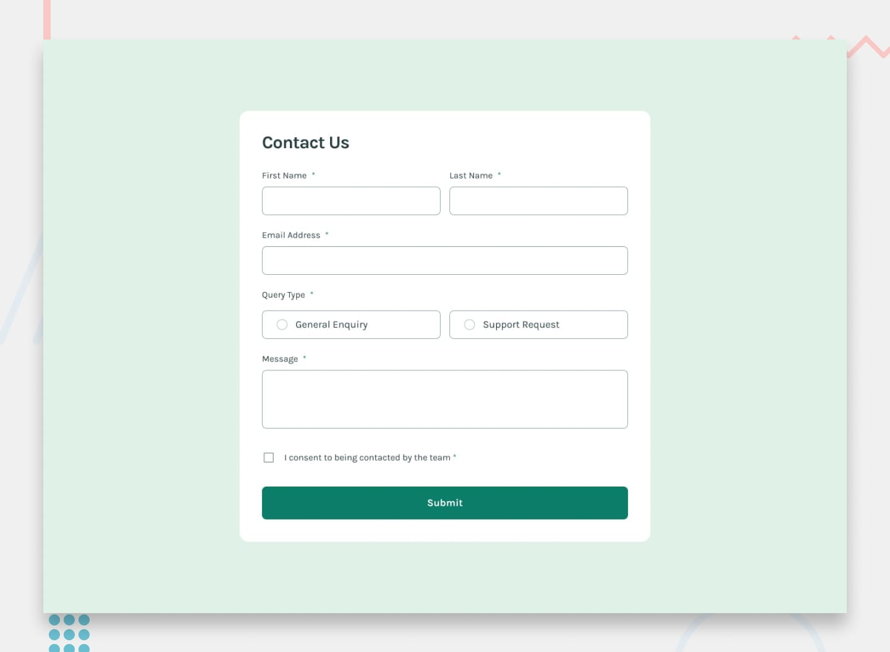

# Formulário de Contato

Aplicação front-end desenvolvida como solução do desafio Frontend Mentor, com foco em validação de formulário, feedback visual para erros e notificação de sucesso via toast.

## Descrição

Este projeto implementa um formulário de contato responsivo com os seguintes comportamentos:

- Validação de campos obrigatórios
- Validação de formato de e-mail
- Seleção de tipo de consulta
- Consentimento obrigatório antes do envio
- Exibição de mensagens de erro por campo
- Exibição de toast de sucesso ao enviar corretamente

## Preview e Imagens

Preview principal:



Referências visuais usadas no desenvolvimento:

- Desktop: [design/desktop-design.jpg](./design/desktop-design.jpg)
- Mobile: [design/mobile-design.png](./design/mobile-design.png)
- Estado de sucesso: [design/success-state.jpg](./design/success-state.jpg)
- Estado de erro: [design/error-state.png](./design/error-state.png)

## Tecnologias

- React 18
- TypeScript
- Vite
- Tailwind CSS
- React Hook Form
- React Toastify

## Dependências

Dependências de produção:

- react
- react-dom
- react-hook-form
- react-toastify

Dependências de desenvolvimento:

- vite
- typescript
- tailwindcss
- postcss
- autoprefixer
- @vitejs/plugin-react
- @types/react
- @types/react-dom

## Como funciona

1. O usuário preenche os campos do formulário.
2. O React Hook Form valida os dados (campos obrigatórios, formato de e-mail e consentimento).
3. Em caso de erro, mensagens específicas são mostradas abaixo dos campos.
4. Em caso de sucesso, os dados são enviados para o handler local e é exibido um toast de confirmação.
5. Após sucesso, o formulário é limpo com reset.

## Estrutura principal

- Interface do formulário: [src/App.tsx](./src/App.tsx)
- Toast customizado: [src/components/Toast/toast.tsx](./src/components/Toast/toast.tsx)
- Estilos globais: [src/index.css](./src/index.css)

## Instalação e execução

### Pré-requisitos

- Node.js 18+ (recomendado)
- npm (ou outro gerenciador compatível)

### Passo a passo

1. Clone o repositório:

```bash
git clone https://github.com/kevenklynsman/contact-form-main.git
```

2. Entre na pasta do projeto:

```bash
cd contact-form-main
```

3. Instale as dependências:

```bash
npm install
```

4. Rode o projeto em desenvolvimento:

```bash
npm run dev
```

5. Para build de produção:

```bash
npm run build
```

6. Para pré-visualizar o build:

```bash
npm run preview
```

## Scripts disponíveis

- `npm run dev`: inicia o servidor de desenvolvimento com Vite
- `npm run build`: compila TypeScript e gera build de produção
- `npm run preview`: executa preview local da build

## Melhorias futuras

- Integração com backend/API real para envio dos dados
- Internacionalização (PT/EN)
- Testes de interface e validação
- Deploy automatizado (CI/CD)

## Contato

- GitHub: [@kevenklynsman](https://github.com/kevenklynsman)
- Repositório: [contact-form-main](https://github.com/kevenklynsman/contact-form-main)

Se quiser contribuir, sinta-se à vontade para abrir uma issue ou pull request.
